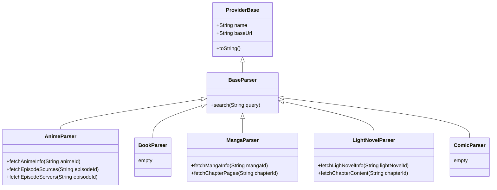

This guide is for the people who are interested Contributing to code, improve documentation, help others. It is not a complete guide yet, but it should help you get started. If you have any questions or any suggestions, please open a [issue](https://github.com/consumet/website/issues) with the label `Documentation`.

## Contribute to code


### Getting Started
1. Clone the repository.
```bash
git clone https://github.com/consumet/extensions.git
```
2. Install dependencies.
```bash
yarn install # or "npm install"
```
3. create a new branch using the name of the provider (source) you want to add.
```bash
git checkout -b <provider-name>
```

### Writing a provider
Each provider is a class that extends abstract class. For example, `Libgen` provider extends `BooksParser` class, and `Gogoanime` extends `AnimeParser`. the parser abstract classes can be found in the `src/models/` folder as follows:
```bash
src/models/anime-parser.ts # AnimeParser
src/models/book-parser.ts  # BookParser
src/models/lightnovel-parser.ts  # LightNovelParser
src/models/comic-parser.ts # ComicParser
src/models/manga-parser.ts # MangaParser
```
You are welcome to add anything to the abstract class that you believe will be beneficial.

#### visualization of the abstract classes hierarchy




#### Project structure
***\<category>*** is the category of the provider. For example, `anime` or `book`, `etc`.\
***\<lang>*** is the language of the provider. For example, `en` or `jp`, `etc`.\
***\<provider-name>*** is the name of the provider. For example, `libgen` or `gogoanime`, `etc`. (must be in camel case)


```bash
> tree src/
src/
├── index.ts
├── providers
│   ├── <category>
│   │   ├── index.ts
│   │   ├── <lang>
│   │   │   ├── index.ts
│   │   │   └── <provider-name>.ts
│   └── <category>
└── utils
```
#### Setting up the provider
1. Create a new file in the `src/providers/<category>/<lang>/<provider-name>.ts` folder.
2. Import the abstract class from the `src/models/<category>-parser.ts` file. if you are writing an anime provider, you would need to implement the abstract class `AnimeParser`, which is defined in the `src/models/anime-parser.ts` file.
3. Start writing your provider code.
4. Add the provider to the `src/providers/<category>/<lang>/index.ts` file.
5. Make a [Pull Request](https://github.com/consumet/extensions/pulls) of the changes.

## Contribute to documentation


- Follow the [Github flow](https://docs.github.com/en/get-started/quickstart/github-flow)
- Follow the [Conventional Commits Specification](https://www.conventionalcommits.org/en/v1.0.0/)